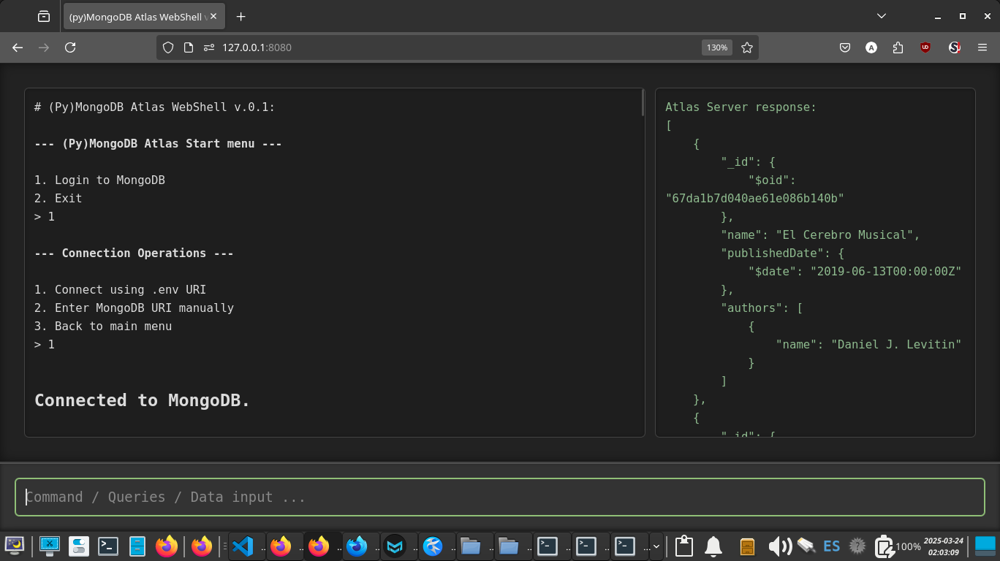

# MongoDB Course / MongoDB Atlas WebShell Project

This repository contains the materials and capstone project for a basic MongoDB course for Bottega.   

The course covers both theory and practice, focusing on local MongoDB and extending it to MongoDB Atlas through a Python-based WebShell that uses `PyMongo`.

---

## Repo Structure

##### 1. `01_MongoDB-Course-Theory`

##### 2. `02_MongoDB-Atlas_Shell`



---

## Project Overview: MongoDB Atlas WebShell

The goal of this project is to provide a user-friendly WebShell interface for interacting with MongoDB Atlas.   

Unlike a local MongoDB shell, Atlas does not support the same command syntax, so this project focuses on using **PyMongo** commands to perform operations.

---

### Prerequisites

- Python 3.x
- MongoDB Atlas account (with a cluster set up)
- Flask and Flask-SocketIO libraries

****

1. Clone this repo and navigate to the 02* folder:

2. Install dependencies:
   
   ```bash
   pip install -r requirements.txt
   ```

3. Set up your `.env` file:
   
   - Create a `.env` file in the project root.   
     **You'll need to configure your own Atlas credentials (Get a free account @ MongoDB Atlas site).**  
   
   - The MongoDB URI completion should be like this:
     
     ```bash
     mongodb://<USER>:<PASSWORD>@<HOST_1>:<PORT>,<HOST_2>:<PORT>,<HOST_3>:<PORT>/?replicaSet=<SETS>
     ```
   
   - Your `.env`file should be completed like this:
     
     ```bash
     MONGO_USER=<USER>
     MONGO_PASS=<PASSWORD>
     MONGO_HOST_1=<HOST_1>
     MONGO_HOST_2=<HOST_2>
     MONGO_HOST_3=<HOST_3>
     MONGO_PORT=<PORT>
     MONGO_SETS=<SETS>
     ```

4. Run `python atlas_webshell.py` and test it at `http://127.0.0.1:8080`

---

## License

This project is open-source and available under the MIT License.   

****

*2025, March*.
